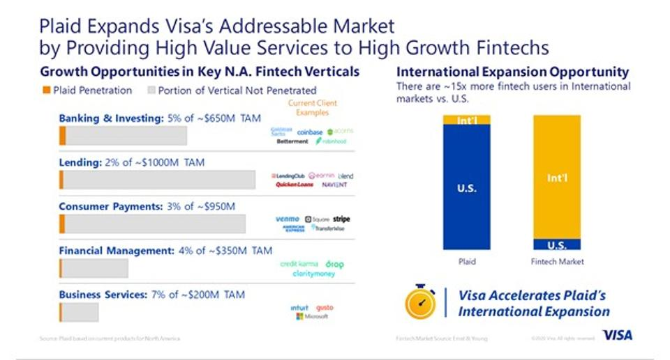

# Plaid Case Study 

## In this case study you will find an analysis on the Plaid business model in regards to its competitive advantage, competitors and future perspectives. 
 

## *Contributors*
Ogo Nwanyanwu,
King Leung,
Steven Cherry, 
Joaquim Curvo Neto,
Hao Fu.

### The secret tool behind Fintechs
Plaid was founded in 2013 by Zach Perret and William Hockey.The pair originally attempted to build consumer financial management products, including budgeting and bookkeeping software. When confronted with difficulties in connecting bank accounts required for these tools, they decided to pivot their core business focus to a unified banking API.

**Background:** 
Plaid was founded in 2013 by Zach Perret and William Hockey.The pair originally attempted to build consumer financial management products, including budgeting and bookkeeping software. When confronted with difficulties in connecting bank accounts required for these tools, they decided to pivot their core business focus to a unified banking API.

**What do they do:** 
The company builds a data transfer network that powers fintech and digital finance products. The company builds a technology platform, which enables applications to connect with users’ bank accounts.Plaid focuses on enabling consumers and businesses to interact with their bank accounts, check balances, and make payments through financial technology applications

**Competitors:** xignite, Finicity,Yodlee, TrueLayer, Figo, InvestCloud, eWise, Sécuribox, Strands and BrandEquity.

**How does this company use technology to their advantage? Why are they considered a FinTech company?**
Plaid allows 3rd Party FinTech companies to communicate with tradition banks via language-agnostic JSON.  This allows FinTech startups to better streamline integration without going through the traditional deposit verification process.  It is also built for developers, which highly increases its adoption rate.  Plaid's APIs allow many of the most popular FinTech companies, like Venmo, Acorns and Coinbase to integrate with banks directly.

**Why is this company exemplary in the FinTech space?**  
Plaid provides an infrastructure technology stack for open banking and account connectivity, allowing various FinTechs to access customer account data via APIs and build across all verticals of financial applications, from payments to wealth management to lending.

**Strengths -** Supports smaller fintech companies and start-ups by providing access to banking workflows and account connectivity, efficiently and inexpensively, allowing new solutions to compete with established players.

**Weakness -** Plaid does not have the scale of large banks and payment providers to help start-ups navigate the regulatory and compliance challenges that are prevalent in banking.  Plaid was recently acquired by VISA, so the technology stack may not remain as open moving forward.  Fees could increase as VISA looks to scale and monetize acquisition, potentially creating payment, banking and account access silos (ie - venmo vs. zelle)

**What is the prognosis for this company? Where do they expect to be in the future?**
The prognosis for Plaid is that it was brought out by Visa Inc. for $5.3 billion which was double the company’s recent valuation of $2.65 billion. In the future, they expect to make open banking the norm globally. Open banking is a financial framework by which an individual’s banking and transaction data can be shared with third-party technology platforms and open-source APIs like Plaid’s. Open banking aims to increase transparency within the banking industry and help consumers better organize and control their financial identity.  Plaid could represent the first large-scale standardized model for open banking. 
